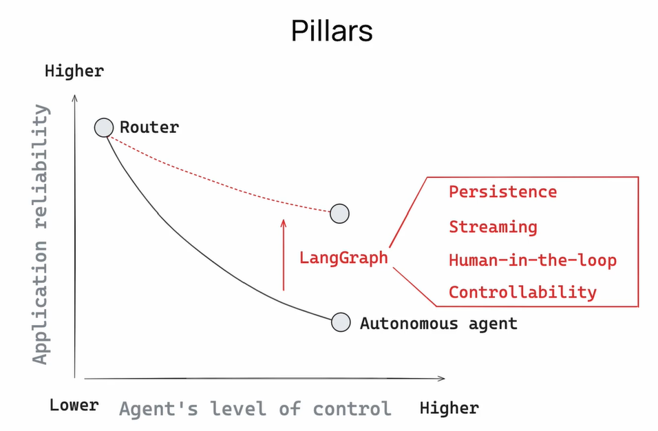
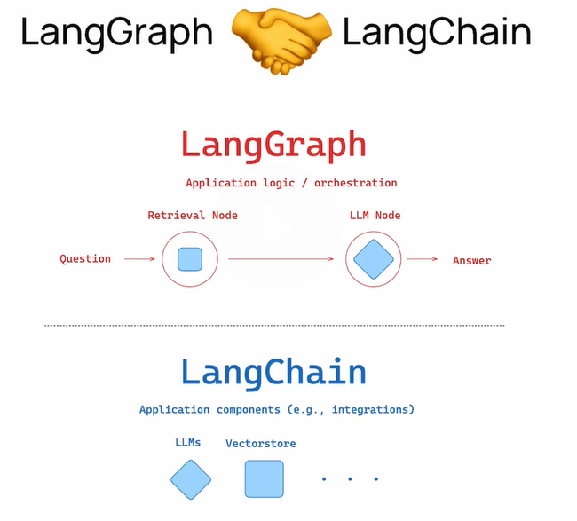

# Introduction to LangGraph

- Course link : https://academy.langchain.com/courses/take/intro-to-langgraph/
- Github : https://github.com/langchain-ai/langchain-academy
- langgraph motivation : https://files.cdn.thinkific.com/file_uploads/967498/attachments/ecd/3cc/6d3/LangChain_Academy_-_Introduction_to_LangGraph_-_Motivation.pdf

## AI Agents
- AI agent is a system that uses an LLM to decide the control flow of an application.
- ```Agent ~= control flow defined by an LLM ```
- A high-level instructions, plans, uses tools, and carries out multiple, iterative steps of processing.

Q. What does it mean to be agentic?
- A system is more “agentic” the more an LLM decides how the system can behave.
- The more agentic your system is, the harder it is to run. It will be more and more complex, having some tasks that will take a long time to complete. This means you will want to run jobs as background runs. This also means you want durable execution to handle any errors that occur halfway through.

### Key hurdles to deploying agents in production: 
- **Unpredictability of LLMs** - Unlike traditional software, AI agents don’t follow a fixed set of rules. Instead, they generate responses dynamically

- **Complexity of orchestration** - Many real-world applications require multiple agents to work together, with each handling different tasks. Coordinating them effectively — including managing task dependencies, error recovery, and communication – adds another layer of difficulty.

- **Observability and debugging limitations** - When an agent makes a bad decision, understanding why can feel like a shot in the dark. Diagnosing failures and maintaining performance require robust tracing and monitoring, which most agent frameworks don’t have built-in.

## Cognitive Architecture 
https://blog.langchain.dev/what-is-a-cognitive-architecture/

- A cognitive architecure is how your system thinks - in other words, the flow of code/prompts/LLM calls that takes user input and perform actions or generates a response.

## LangGraph
- LangGraph, the agent orchestrator to help with building, running, and interacting with agents
- A framework for building a multi-agent applications. 
- It's core design philosophy to developer to add better precision and more control into agentic workflow making them suitale for the complexity of real-world systems.

### What is LangGraph?
- **Low-level and customizable** – LangGraph allows you to flexibly design agents for your company’s bespoke needs. LangGraph primitives are fully descriptive and, unlike higher-level abstractions, can scale beyond prototyping. 

- **Highly reliable** – Gain full control over agent actions with moderation checks, human-in-the-loop, and persisted context for long-running workflows — so your agent can stay on course. 

- **Optimized for observability** – While LangGraph doesn’t depend on any other LangChain product, it integrates seamlessly with LangSmith for added visibility into agent interactions, performance monitoring, and debugging.

### Langgraph Pillars



### LangGraph + Langchain



### Keyconcepts 

 
