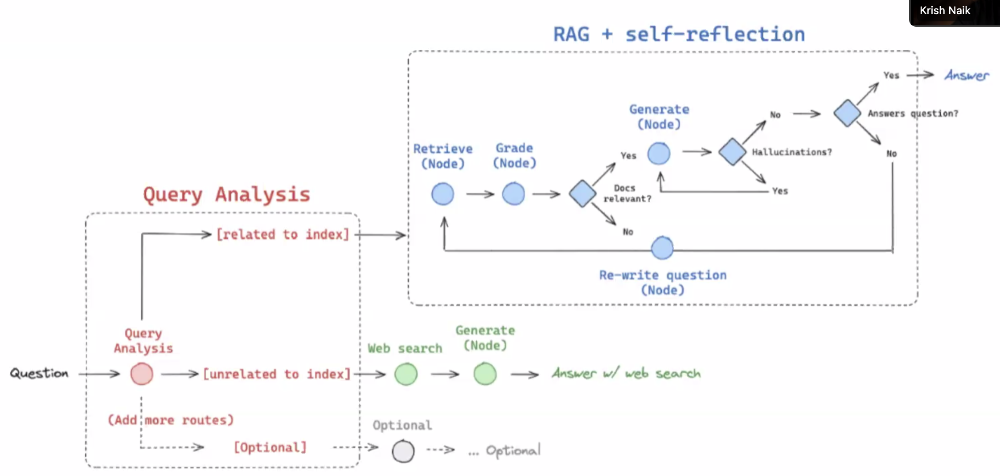
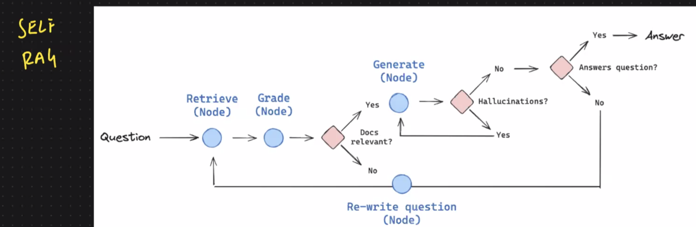

## RAG with LangGraph

1. **Agentic RAG** : Use an gent to figure out how  to retrieve the most relevant information before using the retrieved info to answer the users question. 

- RAG -> Vector Store -> Retriever -> Agent -> Answer

2. Adaptive RAG : A strategy that unites query analysis and active/self corrective RAG.

- https://langchain-ai.github.io/langgraph/tutorials/rag/langgraph_adaptive_rag/#llms

3. Self Corrective RAG : A strategy that uses a RAG to answer the user's question and then corrects the answer if it's not correct.

