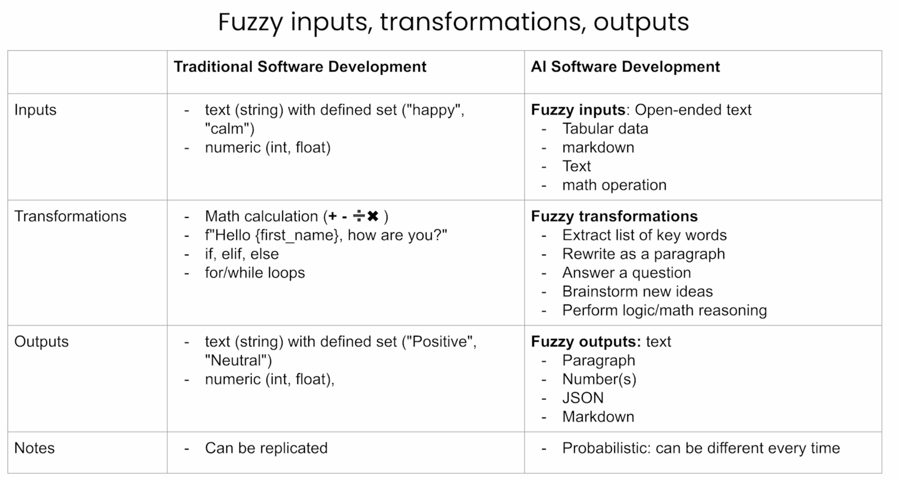
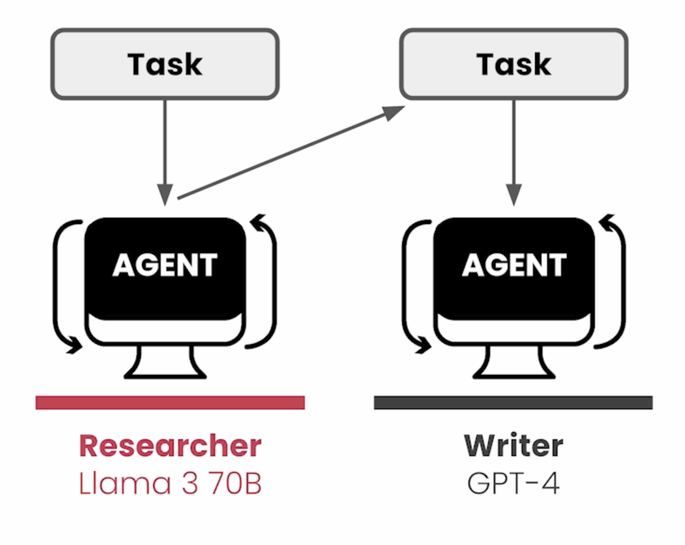

# CrewAI

1. CrewAI is a framework and platform that allows you to create and manage your AI agents.
- Provide a patterns to put these systems together
- Provides tools/ skill  ready ro be used by agents 
- Gives you a model to build custom tools for agents 
- Offers a platform for bringing these agents into production

2. Building blocks 
- Agents 
- Tasks 
- Crews 

## To be learn

- Overview : Research and write a technical article 
- Multi-Agents core concepts : Customer support AI agents 
- Using tools at scale: Customer outreach assistant 
- Tasks and Processes  : Event Planning 
- Agentic collaboration : Financial analyst 
- Build a complete crew : Tailer-made resume 

## Traditional vs AI systems

## Data Collection and Analysis 

Website Visitor -> Lead -> Crew of AI agents -> Sales (Hgh | Medium | Low Priority)
                        - Research (Data collection)
                        - Comparison
                        - Scoring
                        - Talking points

## AI-Agents 

- In LLMs
    - you give the tasks (prompt)-> predicts the next mostly likely tokens (create content) -> implies on a kind of cognition (reasonably react) -> re-prompts to get the best output
    - But the problems over here is that, you need to have a good prompt to get the best output and every time you want to change the prompt, you need to re-prompt the model.  

- Agents (LLMs + Thinking Process) ->  Tasks -> Agents + Tools -> Output 
    - Throughout it ask question and answer the questions itself.
    - Get better output by itself
    - Agents can be used to solve complex tasks by using tools
    - Tools
        - Allows agents to interact with the external world
        - Can be used to get information (Web-search, API-calls, Database, etc)
        - Posting something on the internet (Social Media, etc)

- Multi-Agents
    - Contains multiple agents in the system
    - Agents can assign tasks to each other 
    - Agents can be of different types with different LLMs 
    - Allows you to get very focus agents, that will be able to achieve better results 

## Key elements of AIAgents 

1. Role Playing: Role, Goal backstory -> Give the context
    - e.g : You are a FINRA approved financial analyst. Give me an analysis of tesla stocks.
2. Focus
    - If you fix this upo too much -> To many tools - To much information, context -> You can still loose importance information -> LLM can Hallucinate.
    - You need to give the right focus to the agents
    - Focus on amount of tools, content that they get sent and what they trying to achieve. 
    - Use multiple agents to get the best result. 
3. Tools
    - Don't overload the Agents with lots of tools -> LLM can get confused.
    - Provide the right tools to the agents -> according to the job they need to do.
4. Cooperation
    - Ability to cooperate with each other, makes a huge difference on producing better outcomes.
    - Always setup agents in collaborate environment.
    - Collaboration:
        - Take feedback from each other
        - Delegate tasks to each other 
5. Guardrails 
    - AI application in applying fuzzy inputs, fuzzy transformers and fuzzy outputs. -> Don't give strong typed results. 
6. Memory
    - If no memory -> Every time you will get the different results.
    - Ability to remember what it has done -> use this data to inform new decisions and new execution. 
    - Ability to recollect that it did in the past -> Lear from it and apply their knowledge into future execution. 
    - 3 Types of Memory:
        - Short-term memory: 
            - Needs only in the crew execution.
            - Useful because different LLMs try to do different tasks -> they store different information that they learn in this memory. 
            - Share knowledge, activities, and learnings with other agents.
        - Long-term memory: 
            - Stores after execution of current tasks.
            - This store in the database locally. 
            - Every time agents perform a tasks, if self critiques itself to learn what it should have done better. 
            - What are the things it should be in there that are not, and stores that information so that it can tap back into that when it's running once again. 
            - And then Use this knowledge to produce better and more reliable outcomes.
        - Entity memory: 
            - Sort lived -> Only needed during the execution of the crew.
            - Stores what are the subjects that are being discussed
            - If the agents is trying to learn about a specific company, it will store that company information in the entity memory.
            - Entity:
                - Person
                - Organization
                - Product
                - Event
                - Location
                - Object

