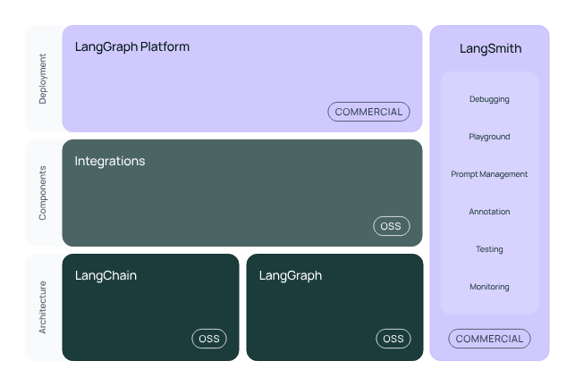
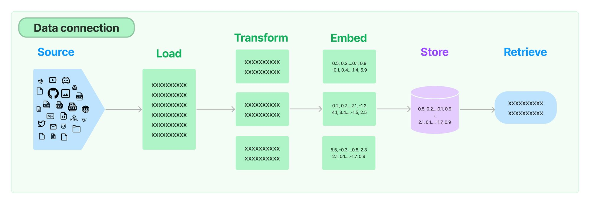
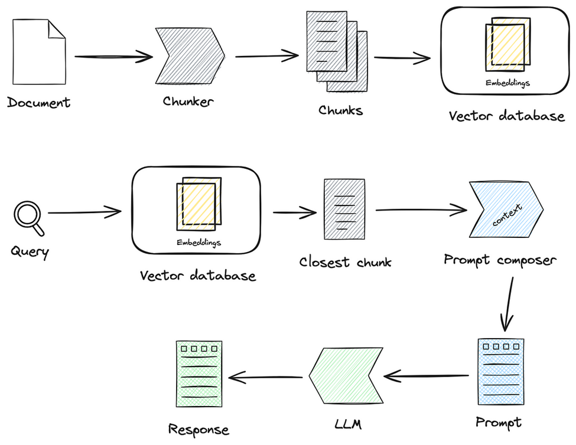
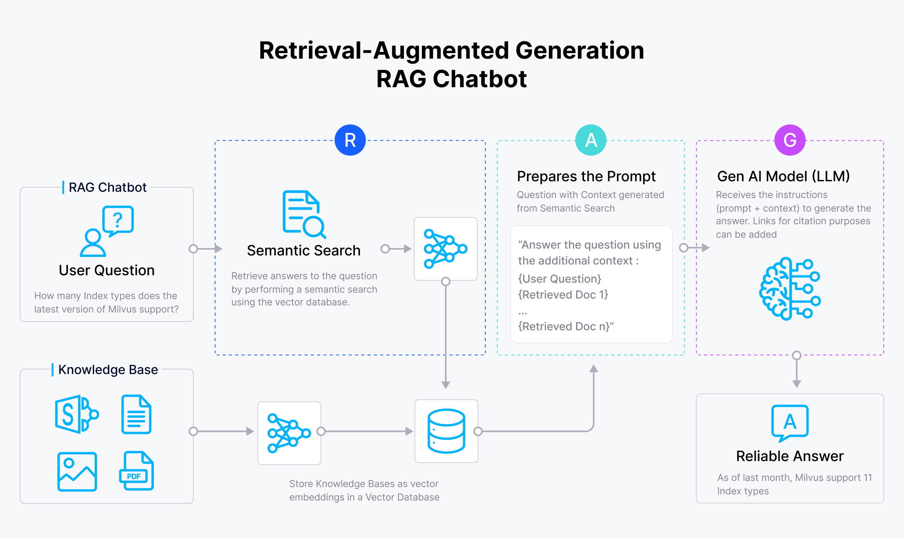

# LangChain Ecosystem

- LangChain - AI-agents
- Components - Tools -> Web Scrapping, Web Search
- LangGraph - More better than Langchain -> To create complex workflows
- LangServe - FastAPIs + Streamlit => To make Gen-AI app deployable in the form the APIs
- LangSmith - For debugging, testing and monitoring

## RAG - Todos

- DataLoader
- Embeddings
- langchain_text_splitters
- vectorstores
- RAG implementation
